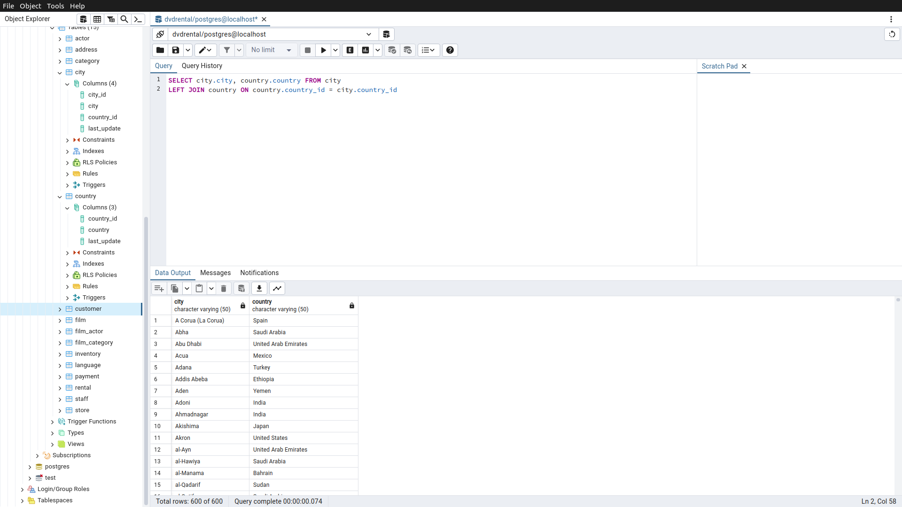
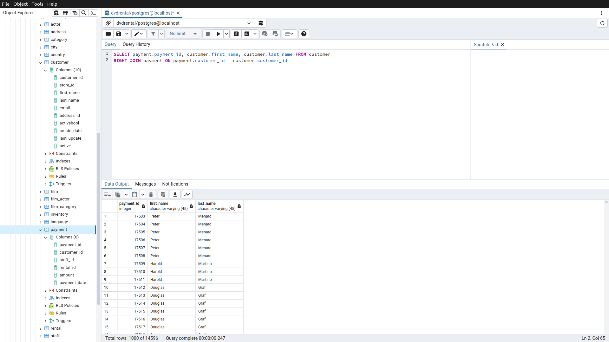
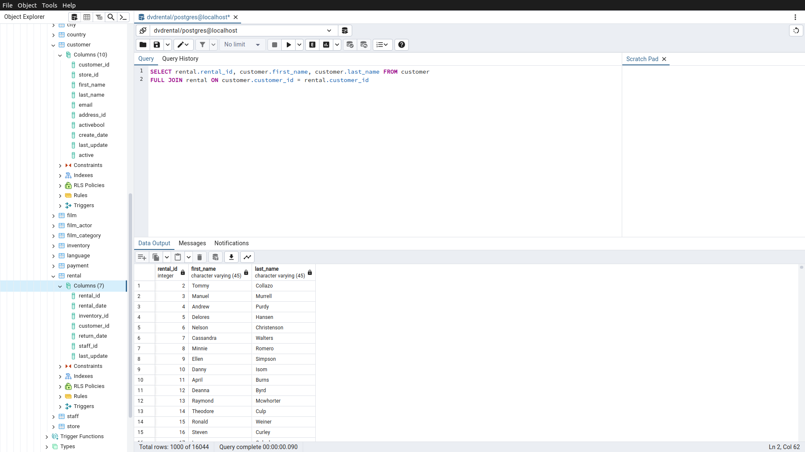

# Homework9

Bu ödevde [PostgreSQL](https://www.postgresqltutorial.com/) Tutorial sayfasındaki [örnek veritabanı](https://www.postgresqltutorial.com/postgresql-getting-started/postgresql-sample-database/) kullanılmıştır.
Örnek veritabanını indirmek için [tıklayınız](https://www.postgresqltutorial.com/wp-content/uploads/2019/05/dvdrental.zip).

------

## Örnek1

city tablosu ile country tablosunda bulunan şehir (city) ve ülke (country) isimlerini birlikte görebileceğimiz LEFT JOIN sorgusunu yazınız.

Sorgu : 

**SELECT city.city, country.country FROM city**

**LEFT JOIN country ON country.country_id = city.country_id**

-----

## Örnek2

customer tablosu ile payment tablosunda bulunan payment_id ile customer tablosundaki first_name ve last_name isimlerini birlikte görebileceğimiz RIGHT JOIN sorgusunu yazınız.

Sorgu : 

**SELECT payment.payment_id, customer.first_name, customer.last_name FROM customer**

**RIGHT JOIN payment ON payment.customer_id = customer.customer_id**

-----

## Örnek3

customer tablosu ile rental tablosunda bulunan rental_id ile customer tablosundaki first_name ve last_name isimlerini birlikte görebileceğimiz FULL JOIN sorgusunu yazınız.

Sorgu : 

**SELECT rental.rental_id, customer.first_name, customer.last_name FROM customer**

**FULL JOIN rental ON customer.customer_id = rental.customer_id**

-----