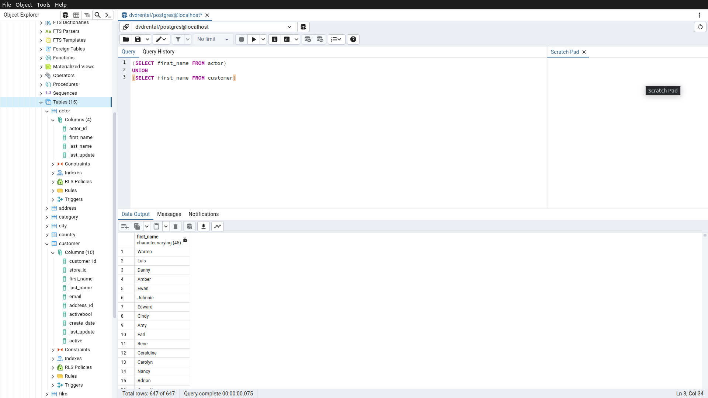

# Homework9

Bu ödevde [PostgreSQL](https://www.postgresqltutorial.com/) Tutorial sayfasındaki [örnek veritabanı](https://www.postgresqltutorial.com/postgresql-getting-started/postgresql-sample-database/) kullanılmıştır.
Örnek veritabanını indirmek için [tıklayınız](https://www.postgresqltutorial.com/wp-content/uploads/2019/05/dvdrental.zip).

------

## Örnek1.1

actor ve customer tablolarında bulunan first_name sütunları için tüm verileri sıralayalım.

Sorgu : 

**(SELECT first_name FROM actor)**

**UNION**

**(SELECT first_name FROM customer)**

-----

## Örnek1.2

actor ve customer tablolarında bulunan first_name sütunları için tüm verileri sıralayalım. (Tekrar eden verileri de göster.)

Sorgu : 

**(SELECT first_name FROM actor)**

**UNION ALL**

**(SELECT first_name FROM customer)**

-----

## Örnek2.1

actor ve customer tablolarında bulunan first_name sütunları için kesişen verileri sıralayalım.

Sorgu : 

**(SELECT first_name FROM actor)**

**INTERSECT**

**(SELECT first_name FROM customer)**

-----

## Örnek2.2

actor ve customer tablolarında bulunan first_name sütunları için kesişen verileri sıralayalım. (Tekrar eden verileri de göster.)

Sorgu : 

**(SELECT first_name FROM actor)**

**INTERSECT ALL**

**(SELECT first_name FROM customer)**

-----

## Örnek3.1

actor ve customer tablolarında bulunan first_name sütunları için ilk tabloda bulunan ancak ikinci tabloda bulunmayan verileri sıralayalım.

Sorgu : 

**(SELECT first_name FROM actor)**

**EXCEPT**

**(SELECT first_name FROM customer)**

-----

## Örnek3.2

actor ve customer tablolarında bulunan first_name sütunları için ilk tabloda bulunan ancak ikinci tabloda bulunmayan verileri sıralayalım. (Tekrar eden verileri de göster.)

Sorgu : 

**(SELECT first_name FROM actor)**

**EXCEPT ALL**

**(SELECT first_name FROM customer)**

