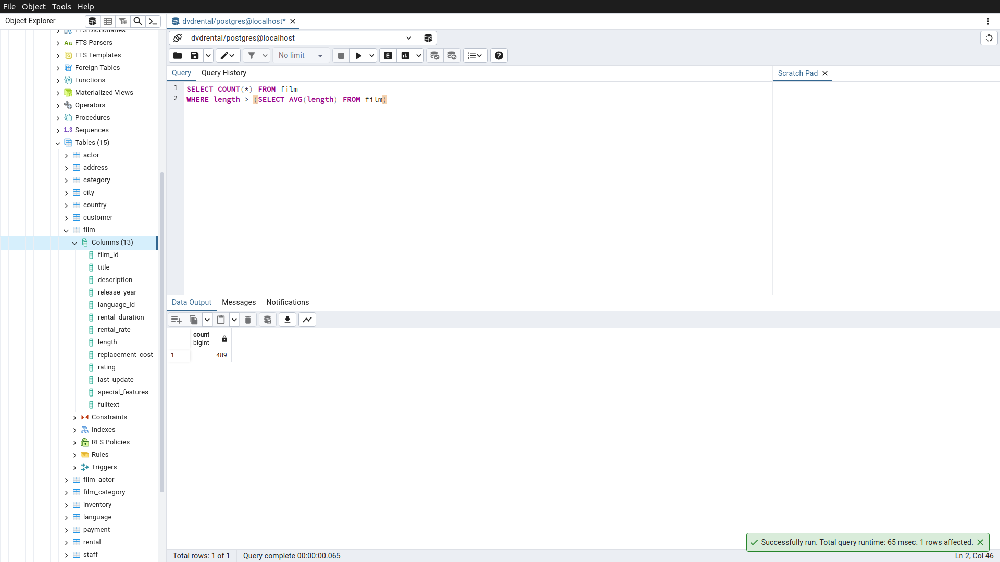
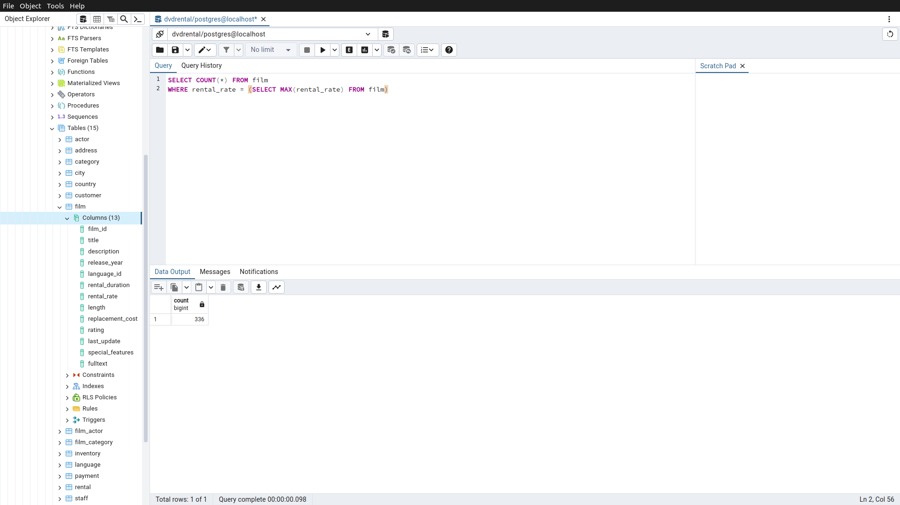
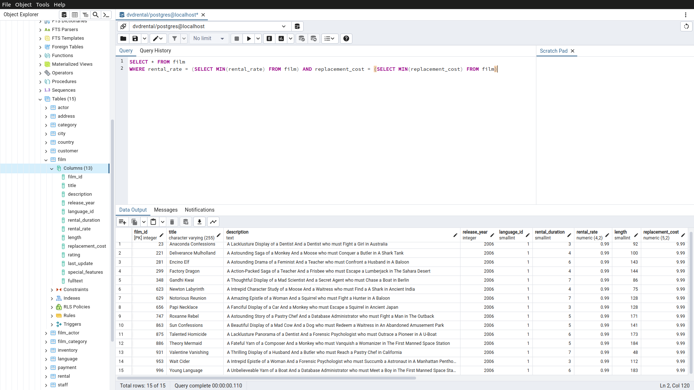
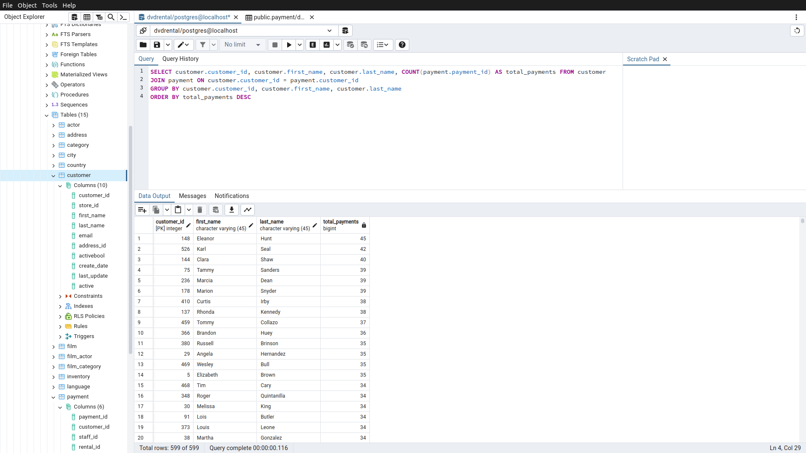

# Homework12

Bu ödevde [PostgreSQL](https://www.postgresqltutorial.com/) Tutorial sayfasındaki [örnek veritabanı](https://www.postgresqltutorial.com/postgresql-getting-started/postgresql-sample-database/) kullanılmıştır.
Örnek veritabanını indirmek için [tıklayınız](https://www.postgresqltutorial.com/wp-content/uploads/2019/05/dvdrental.zip).

------

## Örnek1

film tablosunda film uzunluğu length sütununda gösterilmektedir. Uzunluğu ortalama film uzunluğundan fazla kaç tane film vardır?

Sorgu : 

**SELECT COUNT(*) FROM film**

**WHERE length > (SELECT AVG(length) FROM film)**

-----

## Örnek2

film tablosunda en yüksek rental_rate değerine sahip kaç tane film vardır?

Sorgu : 

**SELECT COUNT(*) FROM film**

**WHERE rental_rate = (SELECT MAX(rental_rate) FROM film)**

-----

## Örnek3

film tablosunda en düşük rental_rate ve en düşün replacement_cost değerlerine sahip filmleri sıralayınız.

Sorgu : 

**SELECT * FROM film**

**WHERE rental_rate = (SELECT MIN(rental_rate) FROM film) AND replacement_cost = (SELECT MIN(replacement_cost) FROM film)**

-----

## Örnek4

payment tablosunda en fazla sayıda alışveriş yapan müşterileri(customer) sıralayınız.

Sorgu : 

**SELECT customer.customer_id, customer.first_name, customer.last_name, COUNT(payment.payment_id) AS total_payments FROM customer**

**JOIN payment ON customer.customer_id = payment.customer_id**

**GROUP BY customer.customer_id, customer.first_name, customer.last_name**

**ORDER BY total_payments DESC**

