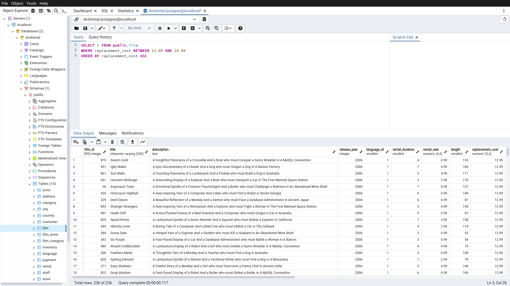
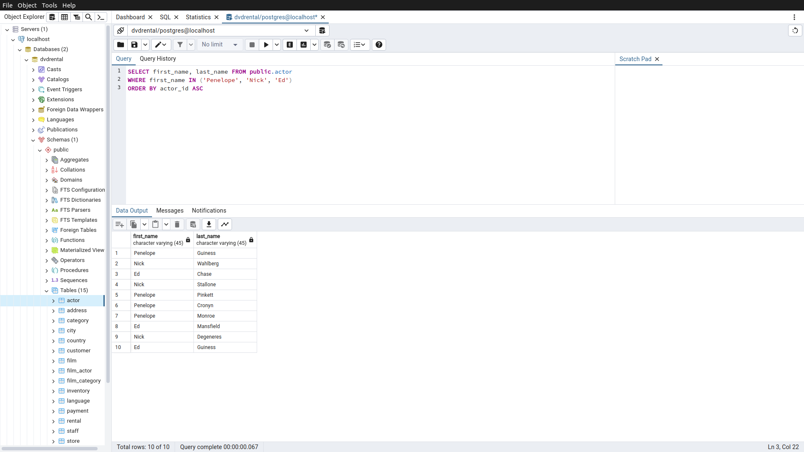
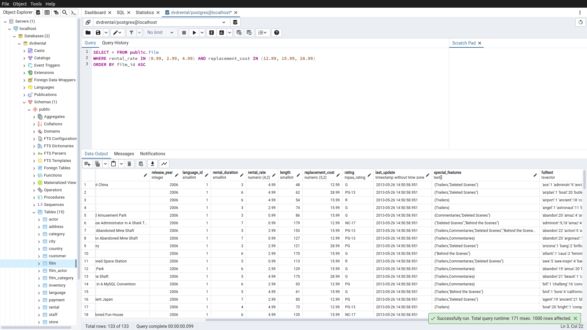

# Homework2

Bu ödevde [PostgreSQL](https://www.postgresqltutorial.com/) Tutorial sayfasındaki [örnek veritabanı](https://www.postgresqltutorial.com/postgresql-getting-started/postgresql-sample-database/) kullanılmıştır.
Örnek veritabanını indirmek için [tıklayınız](https://www.postgresqltutorial.com/wp-content/uploads/2019/05/dvdrental.zip).

-----

## Örnek1

film tablosunda bulunan tüm sütunlardaki verileri replacement cost değeri 12.99 dan büyük eşit ve 16.99 küçük olma koşuluyla sıralayınız ( BETWEEN - AND yapısını kullanınız.)

Sorgu : 

**SELECT * FROM public.film**

**WHERE replacement_cost BETWEEN 12.99 AND 16.99**

**ORDER BY replacement_cost ASC**

-----

## Örnek2

actor tablosunda bulunan first_name ve last_name sütunlardaki verileri first_name 'Penelope' veya 'Nick' veya 'Ed' değerleri olması koşuluyla sıralayınız. ( IN operatörünü kullanınız.)

Sorgu : 

**SELECT first_name, last_name FROM public.actor**

**WHERE first_name IN ('Penelope', 'Nick', 'Ed')**

**ORDER BY actor_id ASC**

-----

## Örnek3

film tablosunda bulunan tüm sütunlardaki verileri rental_rate 0.99, 2.99, 4.99 VE replacement_cost 12.99, 15.99, 28.99 olma koşullarıyla sıralayınız. ( IN operatörünü kullanınız.)

Sorgu : 

**SELECT * FROM public.film**

**WHERE rental_rate IN (0.99, 2.99, 4.99) AND replacement_cost IN (12.99, 15.99, 28.99)**

**ORDER BY film_id ASC**

