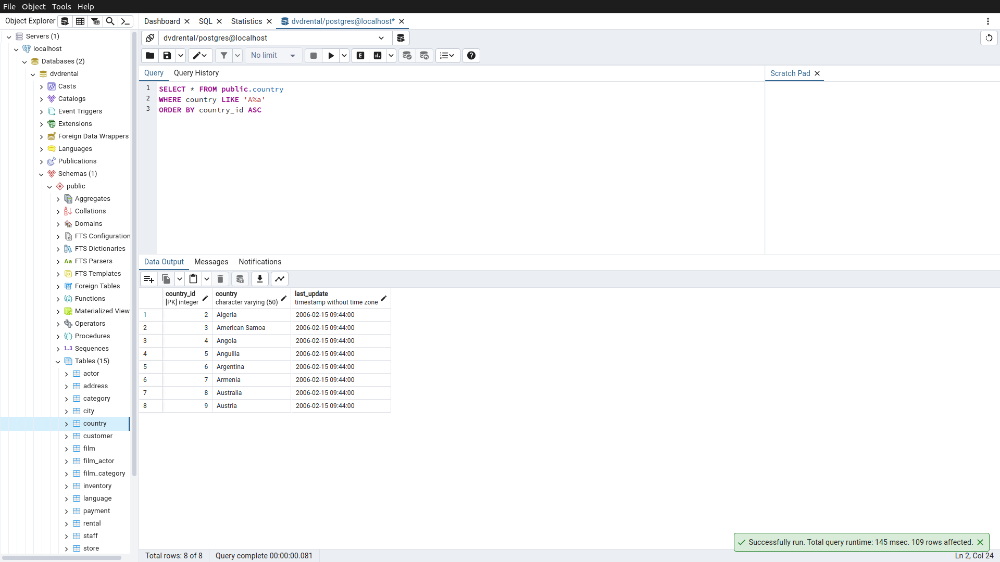
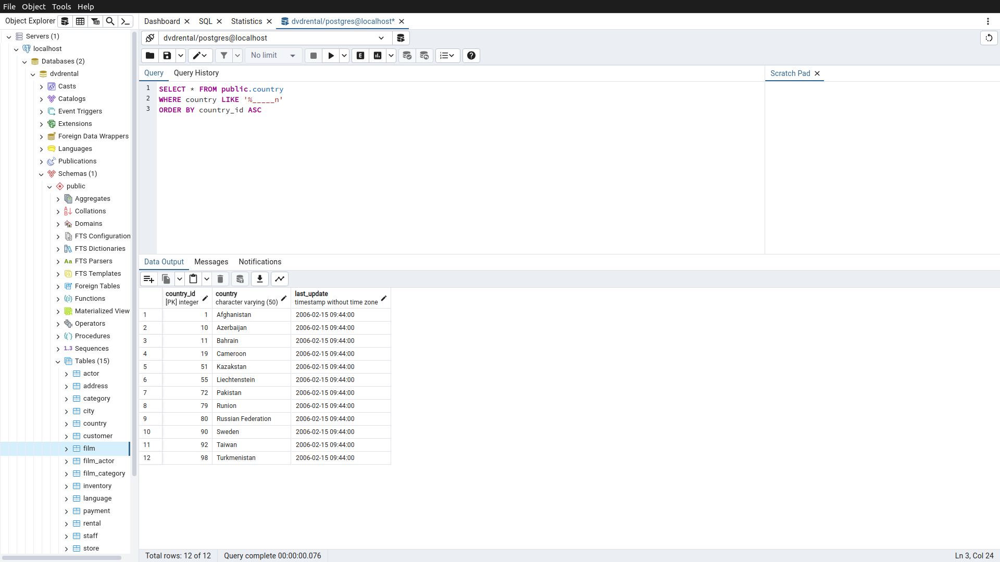
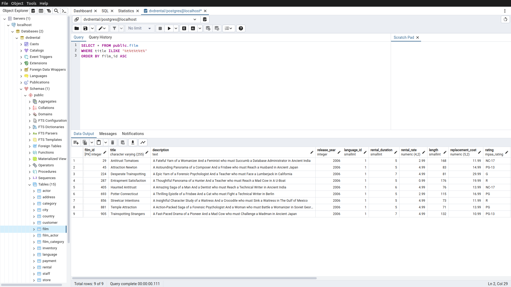

# Homework1

Bu ödevde [PostgreSQL](https://www.postgresqltutorial.com/) Tutorial sayfasındaki [örnek veritabanı](https://www.postgresqltutorial.com/postgresql-getting-started/postgresql-sample-database/) kullanılmıştır.
Örnek veritabanını indirmek için [tıklayınız](https://www.postgresqltutorial.com/wp-content/uploads/2019/05/dvdrental.zip).

------

## Örnek1

country tablosunda bulunan country sütunundaki ülke isimlerinden 'A' karakteri ile başlayıp 'a' karakteri ile sonlananları sıralayınız.

Sorgu : 

**SELECT * FROM public.country**

**WHERE country LIKE 'A%a'**

**ORDER BY country_id ASC**

-----

## Örnek2

country tablosunda bulunan country sütunundaki ülke isimlerinden en az 6 karakterden oluşan ve sonu 'n' karakteri ile sonlananları sıralayınız.

Sorgu : 

**SELECT * FROM public.country**

**WHERE country LIKE '%_____n'**

**ORDER BY country_id ASC**

-----

## Örnek3

film tablosunda bulunan title sütunundaki film isimlerinden en az 4 adet büyük ya da küçük harf farketmesizin 'T' karakteri içeren film isimlerini sıralayınız.

Sorgu : 

**SELECT * FROM public.film**

**WHERE title ILIKE '%t%t%t%t%'**

**ORDER BY film_id ASC**

-----

## Örnek4

film tablosunda bulunan tüm sütunlardaki verilerden title 'C' karakteri ile başlayan ve uzunluğu (length) 90 dan büyük olan ve rental_rate 2.99 olan verileri sıralayınız.

Sorgu : 
