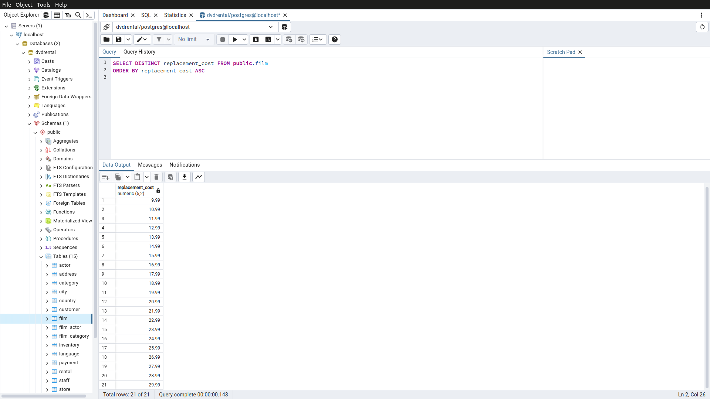
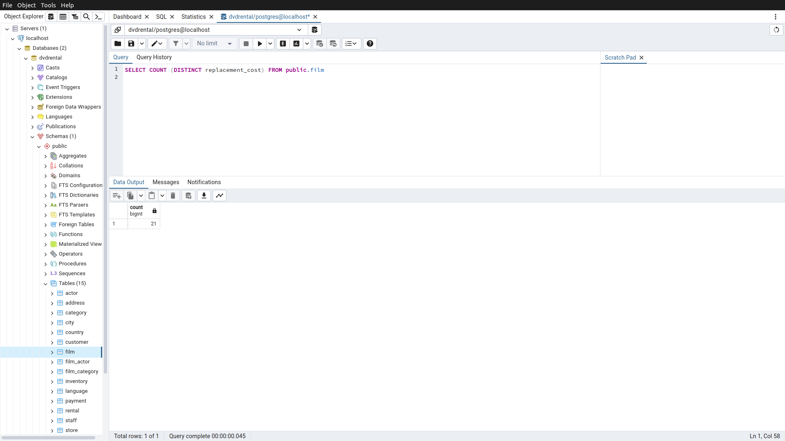
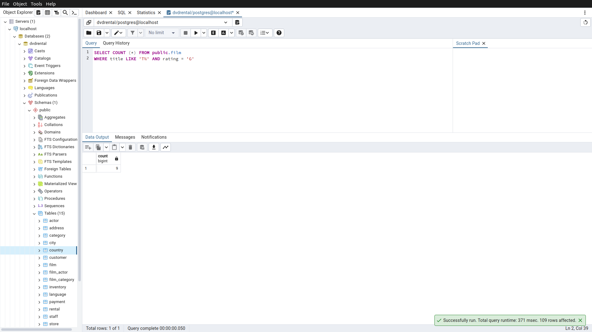
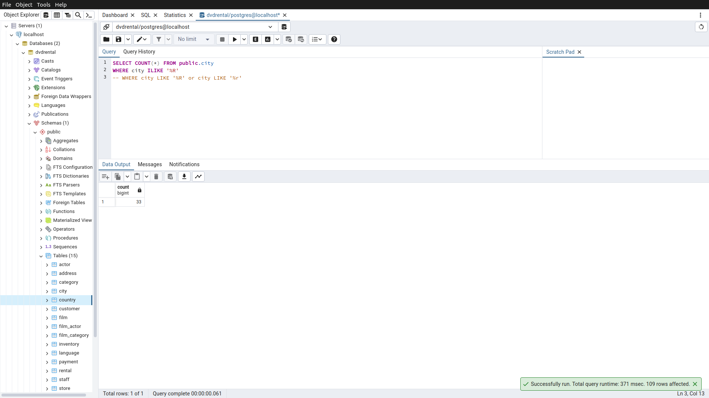

# Homework4

Bu ödevde [PostgreSQL](https://www.postgresqltutorial.com/) Tutorial sayfasındaki [örnek veritabanı](https://www.postgresqltutorial.com/postgresql-getting-started/postgresql-sample-database/) kullanılmıştır.
Örnek veritabanını indirmek için [tıklayınız](https://www.postgresqltutorial.com/wp-content/uploads/2019/05/dvdrental.zip).

------

## Örnek1

film tablosunda bulunan replacement_cost sütununda bulunan birbirinden farklı değerleri sıralayınız.

Sorgu : 

**SELECT DISTINCT replacement_cost FROM public.film**

**ORDER BY replacement_cost ASC**

-----

## Örnek2

film tablosunda bulunan replacement_cost sütununda birbirinden farklı kaç tane veri vardır?

Sorgu : 

**SELECT COUNT (DISTINCT replacement_cost) FROM public.film**

-----

## Örnek3

film tablosunda bulunan film isimlerinde (title) kaç tanesini T karakteri ile başlar ve aynı zamanda rating 'G' ye eşittir?

Sorgu : 

**SELECT COUNT (*) FROM public.film**

**WHERE title LIKE 'T%' AND rating = 'G'**

-----

## Örnek4

country tablosunda bulunan ülke isimlerinden (country) kaç tanesi 5 karakterden oluşmaktadır?

Sorgu : 

**SELECT COUNT(*) FROM public.country**

**WHERE country LIKE '_____'**

-----

## Örnek5

city tablosundaki şehir isimlerinin kaç tanesi 'R' veya r karakteri ile biter?

**SELECT COUNT(*) FROM public.city**

**WHERE city ILIKE '%R'**

**-- WHERE city LIKE '%R' or city LIKE '%r'**

