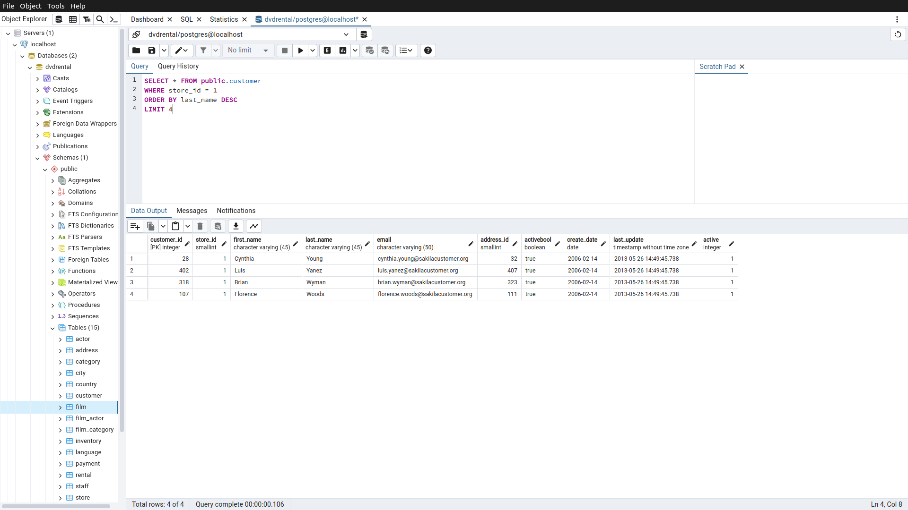

# Homework5

Bu ödevde [PostgreSQL](https://www.postgresqltutorial.com/) Tutorial sayfasındaki [örnek veritabanı](https://www.postgresqltutorial.com/postgresql-getting-started/postgresql-sample-database/) kullanılmıştır.
Örnek veritabanını indirmek için [tıklayınız](https://www.postgresqltutorial.com/wp-content/uploads/2019/05/dvdrental.zip).

------

## Örnek1

film tablosunda bulunan ve film ismi (title) 'n' karakteri ile biten en uzun (length) 5 filmi sıralayınız.

Sorgu : 

**SELECT * FROM public.film**

**WHERE title LIKE '%n'**

**ORDER BY length DESC**

**LIMIT 5**

-----

## Örnek2

film tablosunda bulunan ve film ismi (title) 'n' karakteri ile biten en kısa (length) ikinci(6,7,8,9,10) 5 filmi(6,7,8,9,10) sıralayınız.

Sorgu : 

**SELECT * FROM public.film**

**WHERE title LIKE '%n'**

**ORDER BY length ASC**

**OFFSET 5**

**LIMIT 5**

-----

## Örnek3

customer tablosunda bulunan last_name sütununa göre azalan yapılan sıralamada store_id 1 olmak koşuluyla ilk 4 veriyi sıralayınız.

Sorgu : 

**SELECT * FROM public.customer**

**WHERE store_id = 1**

**ORDER BY last_name DESC**

**LIMIT 4**

