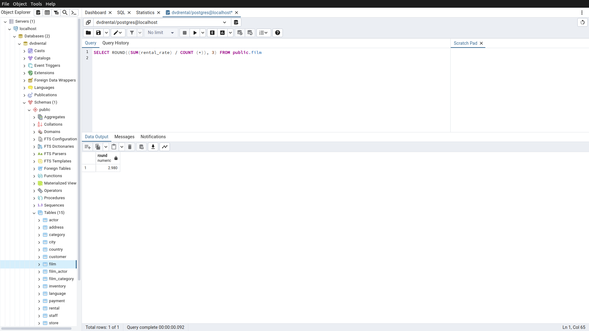

# Homework6

Bu ödevde [PostgreSQL](https://www.postgresqltutorial.com/) Tutorial sayfasındaki [örnek veritabanı](https://www.postgresqltutorial.com/postgresql-getting-started/postgresql-sample-database/) kullanılmıştır.
Örnek veritabanını indirmek için [tıklayınız](https://www.postgresqltutorial.com/wp-content/uploads/2019/05/dvdrental.zip).

------

## Örnek1

film tablosunda bulunan rental_rate sütunundaki değerlerin ortalaması nedir?

Sorgu : 

**SELECT ROUND((SUM(rental_rate) / COUNT (*)), 3) FROM public.film**

-----

## Örnek2

film tablosunda bulunan filmlerden kaç tanesi 'C' karakteri ile başlar?

Sorgu : 

**SELECT COUNT(*) FROM public.film**

**WHERE title LIKE 'C%'**

-----

## Örnek3

film tablosunda bulunan filmlerden rental_rate değeri 0.99 a eşit olan en uzun (length) film kaç dakikadır?

Sorgu : 

**SELECT MAX(length) FROM public.film**

**WHERE rental_rate = 0.99**

-----

## Örnek4

film tablosunda bulunan filmlerin uzunluğu 150 dakikadan büyük olanlarına ait kaç farklı replacement_cost değeri vardır?

Sorgu : 

**SELECT COUNT(DISTINCT replacement_cost) FROM public.film**

**WHERE length > 150**

