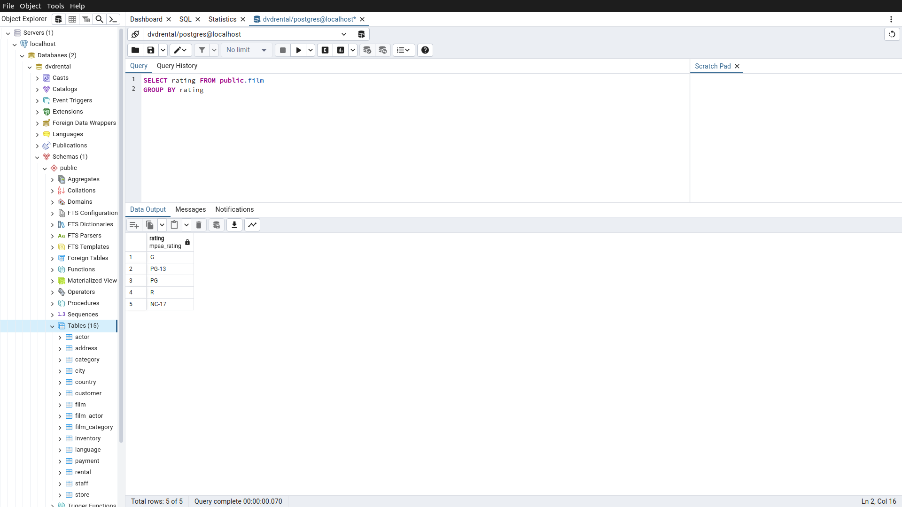
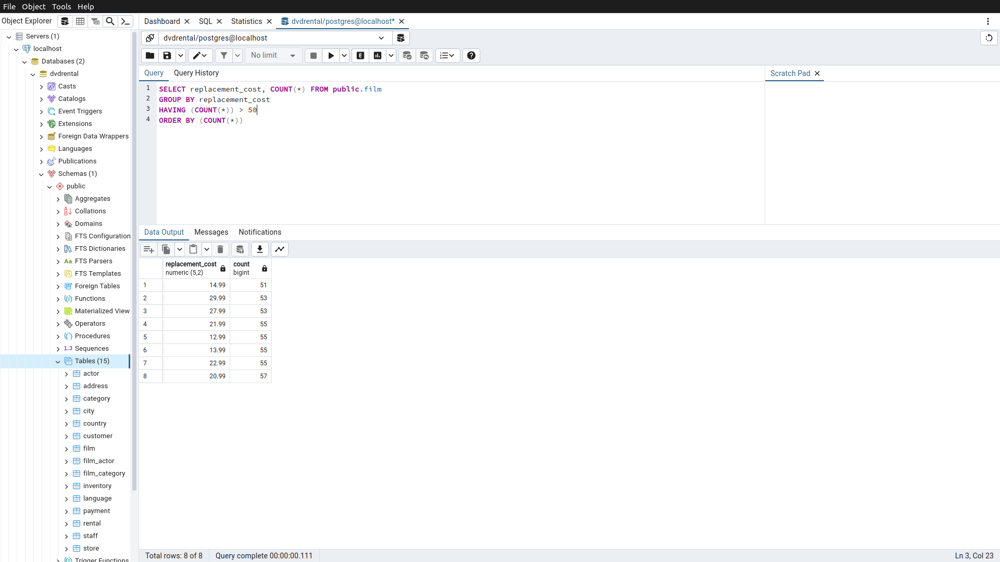
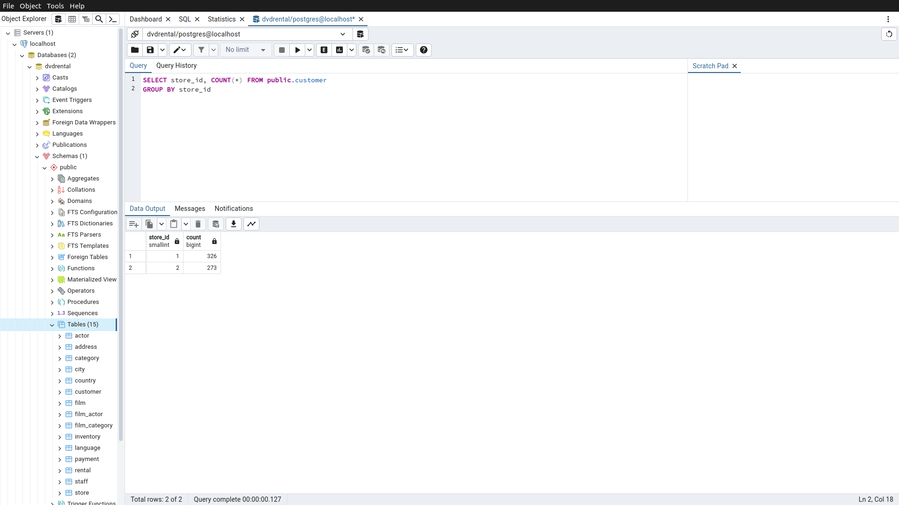
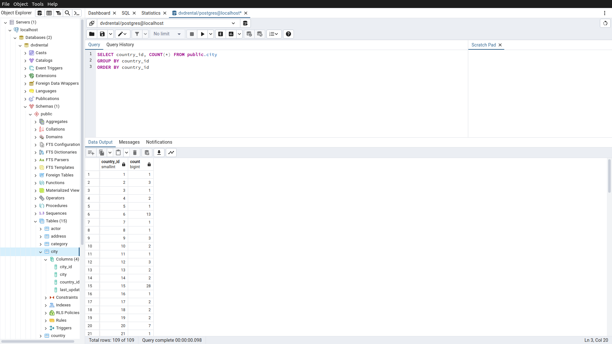

# Homework7

Bu ödevde [PostgreSQL](https://www.postgresqltutorial.com/) Tutorial sayfasındaki [örnek veritabanı](https://www.postgresqltutorial.com/postgresql-getting-started/postgresql-sample-database/) kullanılmıştır.
Örnek veritabanını indirmek için [tıklayınız](https://www.postgresqltutorial.com/wp-content/uploads/2019/05/dvdrental.zip).

------

## Örnek1

film tablosunda bulunan filmleri rating değerlerine göre gruplayınız.

Sorgu : 

**SELECT rating FROM public.film**

**GROUP BY rating**

-----

## Örnek2

film tablosunda bulunan filmleri replacement_cost sütununa göre grupladığımızda film sayısı 50 den fazla olan replacement_cost değerini ve karşılık gelen film sayısını sıralayınız.

Sorgu : 

**SELECT replacement_cost, COUNT(*) FROM public.film**

**GROUP BY replacement_cost**

**HAVING (COUNT(*)) > 50**

**ORDER BY (COUNT(*))**

-----

## Örnek3

customer tablosunda bulunan store_id değerlerine karşılık gelen müşteri sayılarını nelerdir? 

Sorgu : 

**SELECT store_id, COUNT(*) FROM public.customer**

**GROUP BY store_id**

-----

## Örnek4

city tablosunda bulunan şehir verilerini country_id sütununa göre gruplandırdıktan sonra en fazla şehir sayısı barındıran country_id bilgisini ve şehir sayısını paylaşınız.

Sorgu : 

**SELECT country_id, COUNT(*) FROM public.city**

**GROUP BY country_id**

**ORDER BY country_id**

