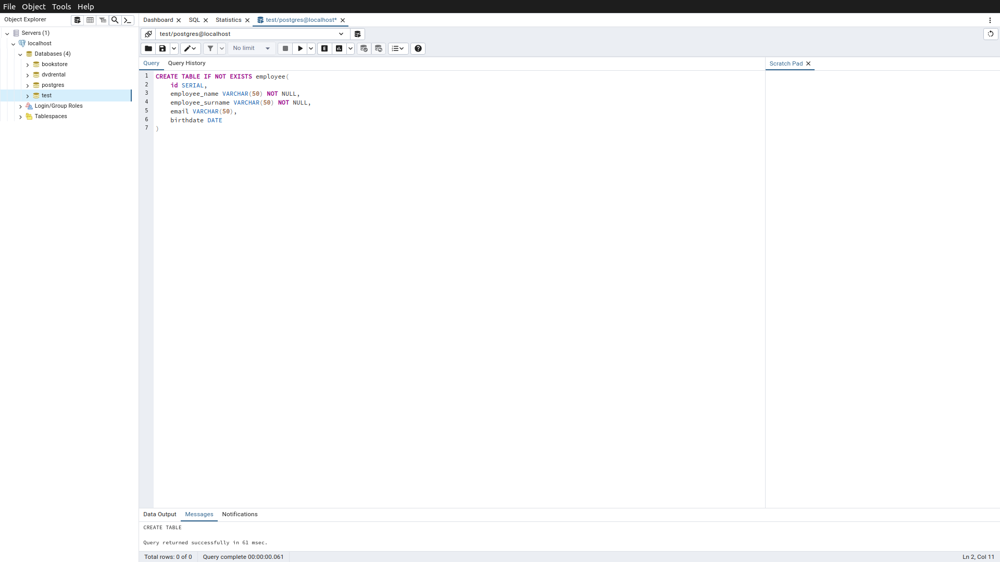
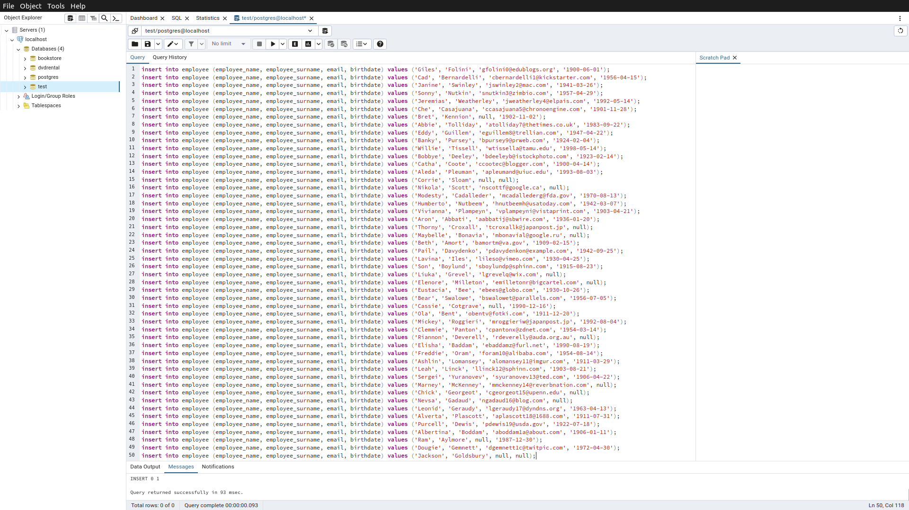
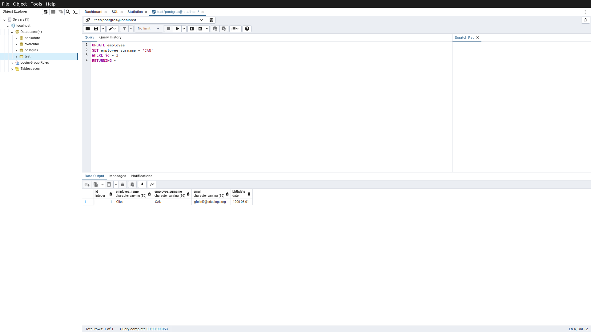
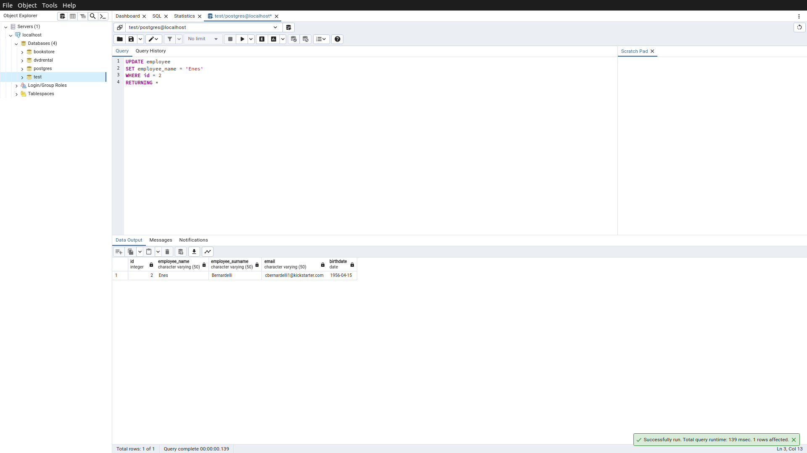
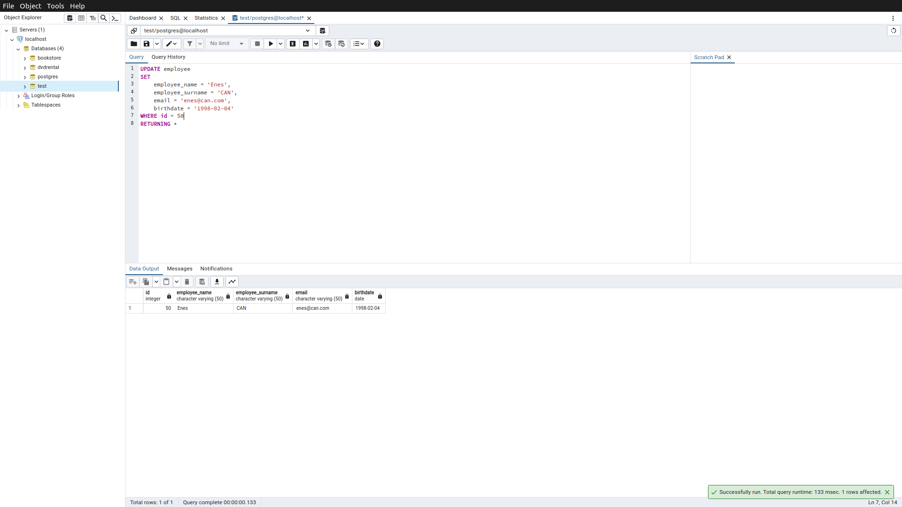
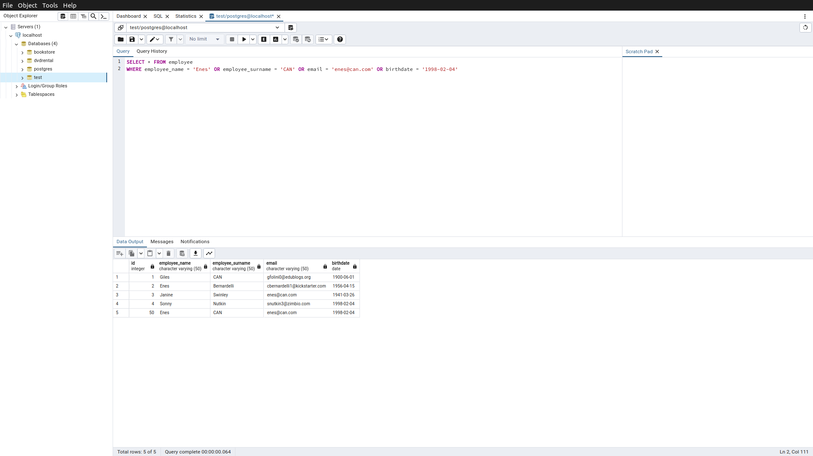
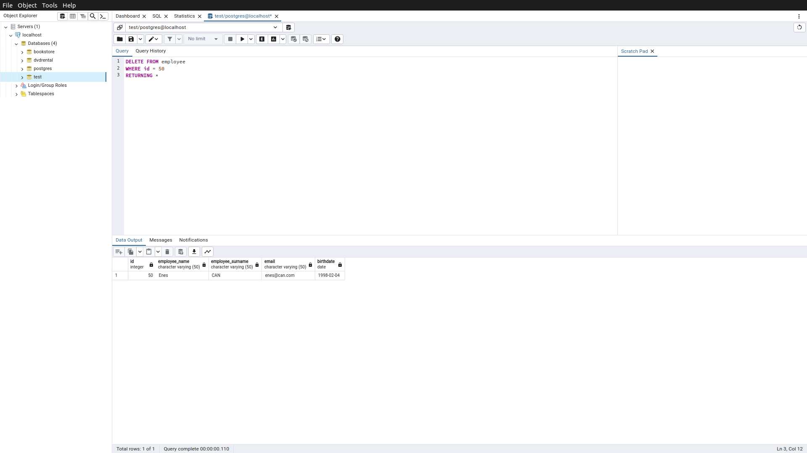
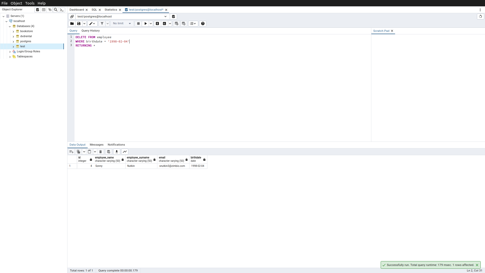
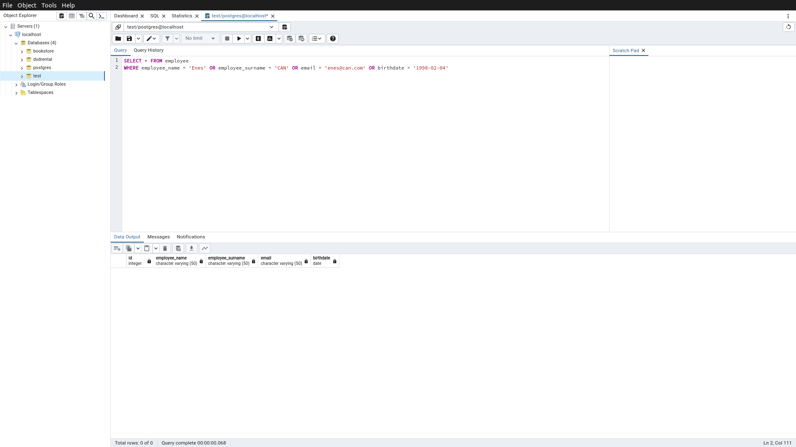

# Homework8

Bu ödevde  servis aracı sayesinde oluşturduğum fake veriler ile SQL programlama dili ile aşağıdaki işlemleri yaptım.

Oluşturduğum 50 satırlık veriye ulaşmak için [tıklayınız](assets/fake_employee_insertion_query.txt)

-----

## Örnek1

test veritabanınızda employee isimli sütun bilgileri id(INTEGER), name VARCHAR(50), birthday DATE, email VARCHAR(100) olan bir tablo oluşturalım.

Sorgu : 

```sql
CREATE TABLE IF NOT EXISTS employee(
	id SERIAL,
	employee_name VARCHAR(50) NOT NULL,
	employee_surname VARCHAR(50) NOT NULL,
	email VARCHAR(50),
	birthdate DATE
)
```



-----

## Örnek2

Oluşturduğumuz employee tablosuna 'Mockaroo' servisini kullanarak 50 adet veri ekleyelim.

Sorgu : 

```sql
insert into employee (employee_name, employee_surname, email, birthdate) values ('Giles', 'Folini', 'gfolini0@edublogs.org', '1900-06-01');
insert into employee (employee_name, employee_surname, email, birthdate) values ('Cad', 'Bernardelli', 'cbernardelli1@kickstarter.com', '1956-04-15');
insert into employee (employee_name, employee_surname, email, birthdate) values ('Janine', 'Swinley', 'jswinley2@mac.com', '1941-03-26');
insert into employee (employee_name, employee_surname, email, birthdate) values ('Sonny', 'Nutkin', 'snutkin3@zimbio.com', '1957-04-29');
insert into employee (employee_name, employee_surname, email, birthdate) values ('Jeremias', 'Weatherley', 'jweatherley4@elpais.com', '1992-05-14');
insert into employee (employee_name, employee_surname, email, birthdate) values ('Che', 'Casajuana', 'ccasajuana5@chronoengine.com', '1901-11-28');
insert into employee (employee_name, employee_surname, email, birthdate) values ('Bret', 'Kennion', null, '1902-11-02');
insert into employee (employee_name, employee_surname, email, birthdate) values ('Abbie', 'Tolliday', 'atolliday7@thetimes.co.uk', '1983-09-22');
insert into employee (employee_name, employee_surname, email, birthdate) values ('Eddy', 'Guillem', 'eguillem8@trellian.com', '1947-04-22');
insert into employee (employee_name, employee_surname, email, birthdate) values ('Banky', 'Pursey', 'bpursey9@prweb.com', '1924-02-04');
insert into employee (employee_name, employee_surname, email, birthdate) values ('Willie', 'Tissell', 'wtissella@tamu.edu', '1998-05-14');
insert into employee (employee_name, employee_surname, email, birthdate) values ('Bobbye', 'Deeley', 'bdeeleyb@istockphoto.com', '1923-02-14');
insert into employee (employee_name, employee_surname, email, birthdate) values ('Catha', 'Coote', 'ccootec@blogger.com', '1900-04-14');
insert into employee (employee_name, employee_surname, email, birthdate) values ('Aleda', 'Pleuman', 'apleumand@uiuc.edu', '1993-08-03');
insert into employee (employee_name, employee_surname, email, birthdate) values ('Corrie', 'Sloam', null, null);
insert into employee (employee_name, employee_surname, email, birthdate) values ('Nikola', 'Scott', 'nscottf@google.ca', null);
insert into employee (employee_name, employee_surname, email, birthdate) values ('Modesty', 'Cadalleder', 'mcadallederg@fda.gov', '1970-08-13');
insert into employee (employee_name, employee_surname, email, birthdate) values ('Humberto', 'Nutbeem', 'hnutbeemh@usatoday.com', '1942-03-07');
insert into employee (employee_name, employee_surname, email, birthdate) values ('Vivianna', 'Plampeyn', 'vplampeyni@vistaprint.com', '1903-04-21');
insert into employee (employee_name, employee_surname, email, birthdate) values ('Aron', 'Abbati', 'aabbatij@sbwire.com', '1936-01-20');
insert into employee (employee_name, employee_surname, email, birthdate) values ('Thorny', 'Croxall', 'tcroxallk@japanpost.jp', null);
insert into employee (employee_name, employee_surname, email, birthdate) values ('Maybelle', 'Bonavia', 'mbonavial@google.ru', null);
insert into employee (employee_name, employee_surname, email, birthdate) values ('Beth', 'Amort', 'bamortm@va.gov', '1909-02-15');
insert into employee (employee_name, employee_surname, email, birthdate) values ('Pail', 'Davydenko', 'pdavydenkon@example.com', '1942-09-25');
insert into employee (employee_name, employee_surname, email, birthdate) values ('Lavina', 'Iles', 'lileso@vimeo.com', '1930-04-25');
insert into employee (employee_name, employee_surname, email, birthdate) values ('Son', 'Boylund', 'sboylundp@sphinn.com', '1915-08-23');
insert into employee (employee_name, employee_surname, email, birthdate) values ('Liuka', 'Grevel', 'lgrevelq@wix.com', null);
insert into employee (employee_name, employee_surname, email, birthdate) values ('Elenore', 'Milleton', 'emilletonr@bigcartel.com', null);
insert into employee (employee_name, employee_surname, email, birthdate) values ('Eustacia', 'Bee', 'ebees@globo.com', '1930-10-26');
insert into employee (employee_name, employee_surname, email, birthdate) values ('Bear', 'Swalowe', 'bswalowet@parallels.com', '1956-07-05');
insert into employee (employee_name, employee_surname, email, birthdate) values ('Cassie', 'Cotgrave', null, '1990-12-16');
insert into employee (employee_name, employee_surname, email, birthdate) values ('Ola', 'Bent', 'obentv@fotki.com', '1911-12-20');
insert into employee (employee_name, employee_surname, email, birthdate) values ('Mickey', 'Roggieri', 'mroggieriw@japanpost.jp', '1992-08-04');
insert into employee (employee_name, employee_surname, email, birthdate) values ('Clemmie', 'Panton', 'cpantonx@zdnet.com', '1954-03-14');
insert into employee (employee_name, employee_surname, email, birthdate) values ('Riannon', 'Deverell', 'rdeverelly@auda.org.au', null);
insert into employee (employee_name, employee_surname, email, birthdate) values ('Elisha', 'Baddam', 'ebaddamz@furl.net', '1990-08-19');
insert into employee (employee_name, employee_surname, email, birthdate) values ('Freddie', 'Oram', 'foram10@alibaba.com', '1954-08-14');
insert into employee (employee_name, employee_surname, email, birthdate) values ('Ashlin', 'Lomansey', 'alomansey11@imgur.com', '1911-03-29');
insert into employee (employee_name, employee_surname, email, birthdate) values ('Leah', 'Linck', 'llinck12@sphinn.com', '1903-08-21');
insert into employee (employee_name, employee_surname, email, birthdate) values ('Sergei', 'Yuranovev', 'syuranovev13@ted.com', '1906-04-22');
insert into employee (employee_name, employee_surname, email, birthdate) values ('Marney', 'McKenney', 'mmckenney14@reverbnation.com', null);
insert into employee (employee_name, employee_surname, email, birthdate) values ('Chick', 'Georgeot', 'cgeorgeot15@upenn.edu', null);
insert into employee (employee_name, employee_surname, email, birthdate) values ('Nevsa', 'Gadaud', 'ngadaud16@blog.com', null);
insert into employee (employee_name, employee_surname, email, birthdate) values ('Leonid', 'Geraudy', 'lgeraudy17@dyndns.org', '1963-04-13');
insert into employee (employee_name, employee_surname, email, birthdate) values ('Alverta', 'Plascott', 'aplascott18@1688.com', '1911-07-31');
insert into employee (employee_name, employee_surname, email, birthdate) values ('Purcell', 'Dewis', 'pdewis19@usda.gov', '1922-07-18');
insert into employee (employee_name, employee_surname, email, birthdate) values ('Albertina', 'Boddam', 'aboddam1a@about.com', '1906-01-11');
insert into employee (employee_name, employee_surname, email, birthdate) values ('Ram', 'Aylmore', null, '1987-12-30');
insert into employee (employee_name, employee_surname, email, birthdate) values ('Dougie', 'Gemnett', 'dgemnett1c@twitpic.com', '1972-04-30');
insert into employee (employee_name, employee_surname, email, birthdate) values ('Jackson', 'Goldsbury', null, null);
```



-----

## Örnek3

Sütunların her birine göre diğer sütunları güncelleyecek 5 adet UPDATE işlemi yapalım.

UPDATE1

```sql
UPDATE employee
SET employee_surname = 'CAN'
WHERE id = 1
RETURNING *
```

UPDATE2

```sql
UPDATE employee
SET employee_name = 'Enes'
WHERE id = 2
RETURNING *
```

UPDATE3

```sql
UPDATE employee
SET email = 'enes@can.com'
WHERE id = 3
RETURNING *
```

UPDATE4

```sql
UPDATE employee
SET birthdate = '1998-02-04'
WHERE id = 4
RETURNING *
```

UPDATE5

```sql
UPDATE employee
SET 
    employee_name = 'Enes',
    employee_surname = 'CAN',
    email = 'enes@can.com',
    birthdate = '1998-02-04'
WHERE id = 50
RETURNING *
```

| UPDATE1 | UPDATE2 | UPDATE3 | UPDATE4 | UPDATE5 |
| ------- | ------- | ------- | ------- | ------- |
|  |  |  |  | 

Tabloda yaptığımız tüm update işlemlerinden sonra ilgili satırları listeleyecek olursak aşağıdaki gibi gözükmektedir.



-----

## Örnek4

Sütunların her birine göre ilgili satırı silecek 5 adet DELETE işlemi yapalım.

DELETE1

```sql
DELETE FROM employee
WHERE id = 50
RETURNING *
```

DELETE2

```sql
DELETE FROM employee
WHERE employee_name = 'Enes'
RETURNING *
```

DELETE3

```sql
DELETE FROM employee
WHERE employee_surname = 'CAN'
RETURNING *
```

DELETE4

```sql
DELETE FROM employee
WHERE email = 'enes@can.com'
RETURNING *
```

DELETE5

```sql
DELETE FROM employee
WHERE birthdate = '1998-02-04'
RETURNING *
```
| DELETE1 | DELETE2 | DELETE3 | DELETE4 | DELETE5 |
| ------- | ------- | ------- | ------- | ------- |
|  |  |  |  | 

Tabloda yaptığımız tüm delete işlemlerinden sonra ilgili satırları listeleyecek olursak aşağıdaki gibi gözükmektedir.

